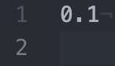

# Cynnovative Coding Exercise

Fork this repository, answer the questions in whichever form you want (e.g. `.txt`, add new `README.md` files, etc.), build your Dockerized programs in the language of your choice, then submit a pull request with your code.

## Question 1 - How big is this file?

The file shown in the following screenshot, with MIME  type `text/plain` is seemingly small. What is the file's size in `bytes`?



## Question 2 - Python and Switch Statements

The programming language Python does not have a `switch` construct. What is a way of recreating a `switch` statement in Python? Write an example that will use the following list of values as cases and actions:

```
Value: 'red', Action: paintItRed()
Value: 'green', Action: paintItGreen()
Value: 'blue', Action: paintItBlue()
Value: 'default', Action: paintIt()
```

## Question 3 - Java Memory

Java uses Heap memory and Stack memory. Can you describe all the differences between them?

## Question 4 - Binary File Analysis

Binary file analysis take variou forms. Write a Dockerized program, in the language of your choice, that finds all the printable `strings` in an input binary file and prints them out to `stdout`.

Example of desired functionality:

```
$ docker build -t $YOUR_DOCKER_IMAGE Dockerfile
$ docker run -it $YOUR_DOCKER_IMAGE find_strings /bin/ls
$ Corresponding Output:
  $FreeBSD: src/bin/ls/cmp.c,v 1.12 2002/06/30 05:13:54 obrien Exp $
  @(#) Copyright (c) 1989, 1993, 1994
  The Regents of the University of California.  All rights reserved.
  $FreeBSD: src/bin/ls/ls.c,v 1.66 2002/09/21 01:28:36 wollman Exp $
  $FreeBSD: src/bin/ls/print.c,v 1.57 2002/08/29 14:29:09 keramida Exp $
  $FreeBSD: src/bin/ls/util.c,v 1.38 2005/06/03 11:05:58 dd Exp $
  \\""
  @(#)PROGRAM:ls  PROJECT:file_cmds-287.40.2
  fffff
  COLUMNS
  1@ABCFGHLOPRSTUWabcdefghiklmnopqrstuvwx%
  bin/ls
  Unix2003
  CLICOLOR
  ...
```

## Question 5 - Circular Prime Numbers

A very interesting mathematical concept is that of circular prime numbers. A circular prime number is a prime number `p` that, when rearraging its digits, all the possible combinations are also prime.

For example, the number `13` is a circular prime because `13` and `31` are primes.

Create a Dockerized program, in the language of your choice, that finds all the circular prime numbers below `500000`.

Example of desired functionality:

```
$ docker build -t $YOUR_DOCKER_IMAGE Dockerfile
$ docker run -it $YOUR_DOCKER_IMAGE circular_primes
$ Corresponding Output:
  2, 3, 5, 7, 11, 13, 17, 31, 37, 71, 73, ...
```
